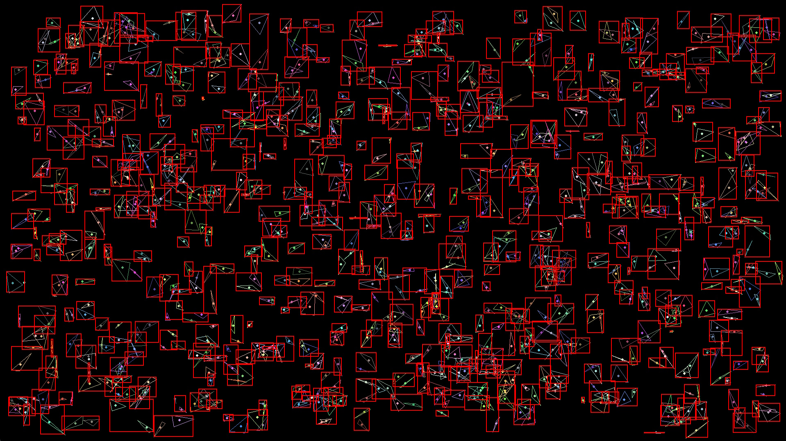
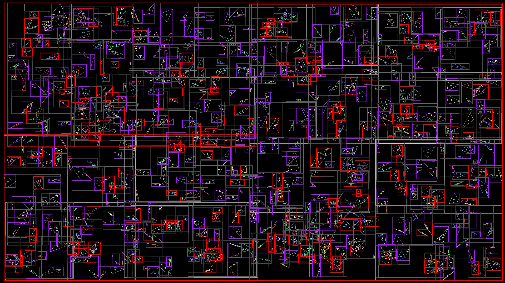

<h1 align="center">BVH Traverse</h1>

2D Bounding Volume Hierarchy visualisation and traversal

## Overview
- Midpoint split
- Pygame interface with intersected triangle highlight (using the mouse pos)
- Press R key to regenerate triangles and BVH
- Press 1 (keypad) to set the render mode to ALL NODES (you can set the view depth using + and - key on the keypad)
- Press 2 (keypad) to set the render mode to LEAF NODES

*This project is part of [my C++ software raytracer](https://github.com/VadamDev/raytracing) and has been made for debug purposes.*

## Gallery

  
  
  
  

## Dependencies
- [pygame](https://www.pygame.org/)

## Resources Used
- https://www.youtube.com/watch?v=C1H4zIiCOaI
- https://jacco.ompf2.com/2022/04/13/how-to-build-a-bvh-part-1-basics/
